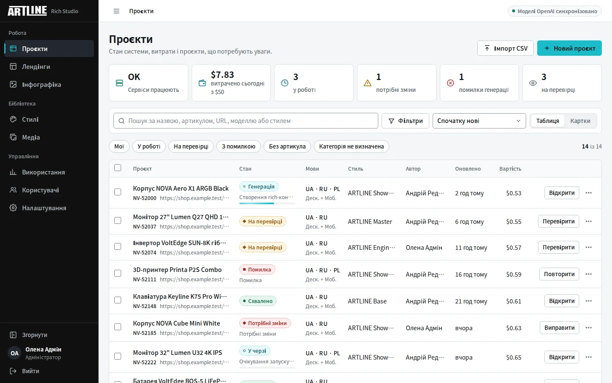
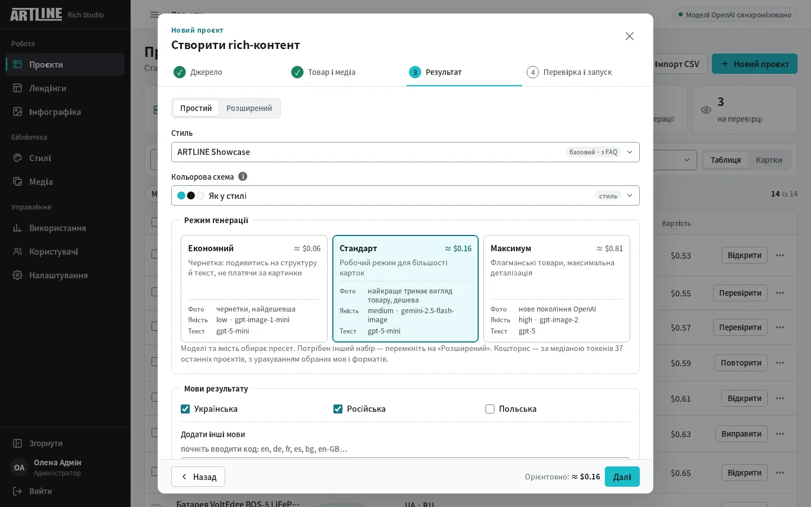
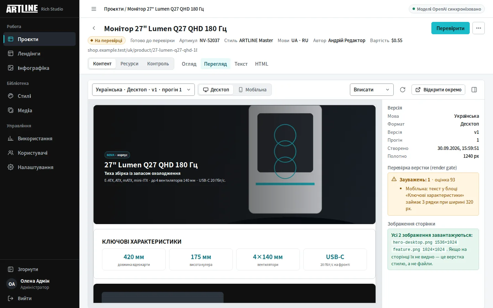
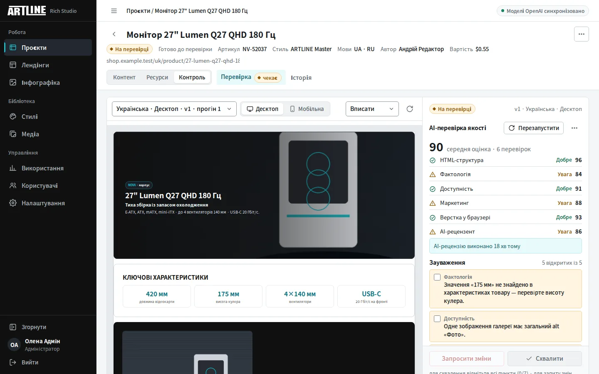
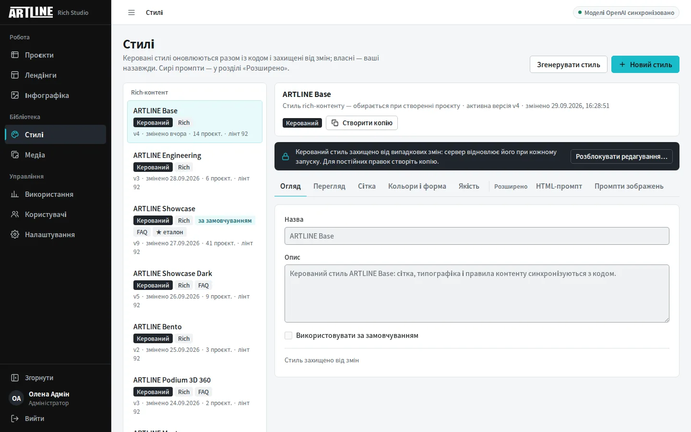
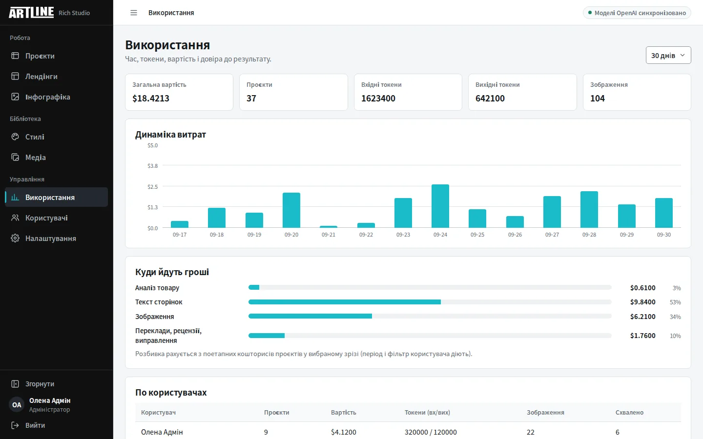

<p align="center">
  
</p>

<p align="center">
  <b>Посилання на товар → готова rich-картка. Посилання на товари й категорії → готовий промо-лендінг.</b><br>
  Факти — лише зі сторінки товару · зображення — з реального фото · публікує людина
</p>

<p align="center">
  
  
  
  
  
</p>

# ARTLINE Rich Studio

Ви вставляєте URL товару. Студія читає сторінку, витягує з неї підтверджені факти, верстає rich-HTML окремо під десктоп і під мобільну — потрібними мовами, домальовує сцену навколо **реального фото товару** і віддає результат людині на перевірку. А з посилань на товари й категорії збирає **промо-лендінг** кампанії — з цінами, кнопками «Купити» і тематичним AI-фоном.

## Навіщо це

Рич-контент для картки товару робиться руками довго й нерівно: копірайтер шукає характеристики, дизайнер верстає, хтось замовляє зображення, і через місяць сусідні картки виглядають як з різних сайтів. Студія прибирає цю рутину, але не прибирає людину: результат завжди проходить рев'ю перед публікацією.

Три принципи, на яких вона побудована:

- **Факти беруться зі сторінки, а не з моделі.** Джерело правди — JSON-LD, таблиці характеристик і spec-блоки самого товару. Вигадати потужність, гарантію чи сумісність модель не має права.
- **Товар не перемальовується.** Зображення — це редагування справжнього фото зі збереженням геометрії, матеріалів, портів і брендування. Немає перевіреного референсу — публікується оригінальне фото, а не вигаданий товар.
- **Публікує людина.** Автоперевірки лише підсвічують проблеми; рішення «Схвалити» приймає редактор.

---

## Інтерфейс

Публічної демо-версії немає і не буде: студія — внутрішня система, працює лише після входу і з вашими ключами моделей. Подивитись її в роботі можна локально (розділ [Швидкий старт](#швидкий-старт)). Знімки нижче зроблено на тестових, повністю вигаданих даних — без реальних клієнтів, цін і людей.

| | |
|---|---|
|  |  |
| **Проєкти.** Робоча черга під роль, компактна таблиця з однією дією в рядку. | **Новий проєкт.** Чотири кроки: джерело → товар і медіа → результат → перевірка й запуск. |
|  |  |
| **Перегляд.** Полотно справжньої ширини, масштаб «вписати», інспектор версії й render gate. | **Перевірка.** Результат і зауваження поруч, рішення закріплене внизу. |
|  |  |
| **Стилі.** Керовані стилі заблоковані від випадкових змін; сирі промпти — у «Розширено». | **Використання.** Витрати, етапи, користувачі й частка схвалень. |

Потрібен локальний запуск: генерація (ключ OpenAI/Gemini), рендер блоків у PNG і render gate (профіль `shots`), публічні посилання лендінгів, вхід через GitHub/Google.

---

## Основні можливості

### Генерація контенту

- **Старт з одного посилання.** Ще до запуску студія читає сторінку (безкоштовно, без AI): показує назву товару, кадри галереї з можливістю виключити зайві та готові AI-зображення з попередніх генерацій цього товару.
- **Масовий імпорт CSV.** Завантажте до 100 URL одним файлом: студія спочатку безкоштовно перевірить структуру й кожен рядок, покаже дублікати/помилки, а після підтвердження створить тільки валідні проєкти. Підтримуються CSV із комою, крапкою з комою або табуляцією та UTF-8 BOM; обовʼязкова колонка — `url` або `source_url`.
- **Повторне використання зображень.** Якщо товар уже генерувався, готові Hero/Feature можна забрати у новий проєкт покадрово й без витрат; вимкнене — перегенерується. Файли копіюються, тож видалення старого проєкту нічого не ламає.
- **Власні фото.** До проєкту можна довантажити свої знімки файлами (опційно): кожне фото вмикається/вимикається кліком і стає кадром галереї, а кнопки Hero/Фіча — і на завантажених фото, і на кадрах галереї сторінки — роблять обране фото головним у відповідний блок без AI-генерації.
- **360°-серії.** Зняли товар по колу — завантажте всю серію (до 200 кадрів): сервер рівномірно відбере 48, стисне їх і збере справжнє покадрове обертання для стилів Podium 3D 360 / Scroll.
- **Покроковий майстер.** Джерело → товар і медіа → результат → перевірка й запуск; назад/вперед нічого не губить. На кроці «Результат» — «Простий» режим (три цінові пресети з живою ціною) або «Розширений» (повний вибір моделей із нотатками, чим кожна сильна).
- **Факти замість вигадок.** Джерело правди — дані самої сторінки: JSON-LD, таблиці характеристик, `<dl>` і spec-блоки з HTML, доповнені AI-аналізом. Модель не має права вигадувати специфікації, гарантії чи сумісність.
- **Дві версії макета.** Desktop (до 1240px) і Mobile (480px) генеруються окремо, з композицією під кожен viewport.
- **До 10 мов.** Українська та Російська — за замовчуванням, решта за ISO/BCP-47 кодом. Інші мови — переклад **лише текстових вузлів** майстер-макета, тому структура, CSS і зображення збігаються між мовами. До готового проєкту мову можна додати кнопкою «+ Мова» — без повторної генерації і витрат на зображення.
- **Мобільна версія — це перекомпонування десктопної**, а не окрема генерація: текст і зображення звіряються механічно, тож дві версії однієї сторінки не можуть розповідати різне.
- **Верстка, що переносить.** Редактор artline вирізає медіа-запити, тому багатоколонкові ряди механічно переписуються в самопереносні сітки: на широкому екрані вигляд той самий, на вузькому картки складаються 2×2, а не вилазять за край.

### Зображення

- **Реальне фото товару.** Головне фото визначається з галереї, `srcset` і zoom-посилань, варіанти одного кадру об’єднуються, обирається найкраща роздільність.
- **Product-in-use генерація.** Hero та Feature створюються **на основі реального фото** зі збереженням геометрії, матеріалів, портів і брендування. Окремі Hero для десктопа (`1536×1024`) і мобільної (`1024×1536`).
- **Два провайдери зображень.** OpenAI (`gpt-image-*`) або Gemini (`gemini-*`); провайдер визначається назвою обраної моделі. Сцену Hero підбирає сервер за категорією товару — модель ніколи не бачить «меню» чужих категорій.
- **Механічні гарантії.** Кожен `` фінальної сторінки звіряється з білим списком реальних зображень (вигадані URL замінюються або видаляються), кадри галереї проходять перевірку живості на CDN, а превʼю саме перевіряє наявність файлів і повідомляє, якщо щось не так.
- **Повна специфікація у Медіа.** Вкладка Медіа містить усі зображення, які реально використовує сторінка: AI-генерації, вихідне фото, кадри галереї.
- **Безпечний відкат.** Якщо перевіреного референсу немає або редагування не вдалося — використовується справжнє фото товару, вигаданий товар не генерується ніколи.

### Стилі

- **Дев'ять вбудованих керованих стилів** (оновлюються автоматично при старті API, захищені від видалення):
  - **`ARTLINE Showcase`** (за замовчуванням) — іміджевий формат на реальних фото галереї: темний Hero-кадр, великі числа, чергування темних і світлих секцій у фірмових кольорах ARTLINE. Для товарів із багатою галереєю; діалог створення сам попереджає, коли кадрів замало.
  - **`ARTLINE Podium`** — «подіумна» подача на реальних фото галереї, без жодного AI-зображення: нуль витрат на генерацію картинок і мінімальний час.
  - **`ARTLINE Podium 3D`** — Подіум, де товар обертається: справжнє CSS-3D «монетне» обертання реального фото. Анімацію вставляє сервер детерміновано; редактор artline її зберігає.
  - **`ARTLINE Podium 3D 360` / `360 Dark`** — справжнє 360° з вашої серії кадрів по колу (hover ставить на паузу); Dark-варіант — темна сцена з ціановим світінням.
  - **`ARTLINE Podium 3D Scroll`** — обертання, привʼязане до прокрутки сторінки (CSS scroll-driven animations; браузери без підтримки бачать автоплей).
  - **`ARTLINE Showcase Dark`** — Showcase повністю в темних тонах: ритм двох темних канв, ціанові акценти, реальні фото на білих картках.
  - **`ARTLINE Engineering`** — технічний регістр: цифри з одиницями, підтверджені механізми, чесні межі застосування.
  - **`ARTLINE Base`** — маркетинговий базовий стиль із системою контентних «острівців».
- **Власні стилі:** AI-генератор стилів, покращення через AI, оцінка якості, історія версій, автозбереження, видалення. Проєкти видаленого стилю переприв’язуються до базового.

### Контроль якості та рев’ю

- **AI-критики:** HTML-структура, фактологія, доступність, маркетинг — швидкі безкоштовні евристики з підсвічуванням зауважень.
- **AI-рецензент (платно):** справжня модель звіряє сторінки з даними товару і пише конкретні зауваження українською; вартість токенів чесно додається до вартості проєкту. Поруч — **платне авто-виправлення**: текст правиться за зауваженнями при замороженому DOM, кожна зміна — нова версія сторінки. Статус «коли запускали і чи виправляли» видно просто на вкладці перевірки.
- **Ручна перевірка:** чеклист, коментар, рішення «Схвалити» / «Запросити зміни» за ролями.
- **Версіонування:** редактор HTML зі збереженням нових версій, повна історія етапів проєкту.
- **Гучний відкат.** Якщо AI-генерація не вдалася і сторінку зібрав аварійний шаблон — це неможливо не помітити: банер у превʼю, позначка у списку версій, заблоковане схвалення й алерт у Telegram. Причина показується людською мовою, без технічних нутрощів.

### SEO, GEO і людський текст

- **Три об'єкти аудиту — три набори правил.** *Rich-фрагмент* (вставляється в картку товару): без `h1`, `<title>`, canonical, hreflang, meta, Open Graph, JSON-LD і прихованого тексту — цим керує картка на artline.ua; фрагмент відповідає за корисний текст, ієрархію `h2/h3`, точні сутності, answer-first абзаци, alt і підтверджений FAQ. *Standalone-лендінг*: один `h1`, `title`, description, canonical, `html lang`, hreflang, Open Graph, Twitter Card, robots за станом публікації, JSON-LD — усе ставить **сервер** з перевірених даних, модель цього не пише. *Інтерфейс студії, API, вхід і медіа* не індексуються взагалі (`X-Robots-Tag: noindex, nofollow, noarchive`).
- **Детерміновані перевірки безкоштовні і перші** (`app/seo_geo.py`): `seo` (структура, сутності, alt, exact-match), `geo` (ясність сутності, answer-first, provenance кожного числа, непідтверджені комерційні твердження, FAQ), `human` (повтори, кальки, generic AI-фрази, суперлативи, оклики, keyword stuffing, текст «про сторінку»), `language` (чистота UA/PL/EN, кирилиця у латинських версіях, ознаки дослівного перекладу). Кожна знахідка — код, рівень, мова, формат, блок, цитата, причина, порада і перехід до фрагмента в редакторі тексту; оцінка 0–100 похідна від знахідок, а не навпаки. Частота ключових слів — діагностика, не ціль.
- **SEO-бриф перед генерацією** (крок «SEO / GEO» у майстрі): ринок, аудиторія, search intent, primary/secondary topics, сутності, питання покупця, заборонені формулювання. Режими: *автоматично з товару* (категорія, сутності, питання — без вигаданих обсягів пошуку), *імпорт* CSV/JSON з Google Search Console, Keyword Planner або DataForSEO (датований snapshot, live-запитів при генерації немає), *вручну*. Бриф — контекст, не факти: ключовий запит не є характеристикою й не може розширити Product JSON.
- **Provenance фактів.** Кожна характеристика має джерело (JSON-LD → таблиця → spec-блок → підтверджено оператором → текст сторінки), цитату й `confirmed`/`derived`; виведені значення в промпт не потрапляють, а число без джерела в тексті — критична знахідка.
- **Publishing Profile** — єдине джерело комерційних тверджень (доставка, гарантія, сервіс, контакти) для rich і лендінгів; проєкт зберігає його знімок. Зараз підтверджено лише «Постачаємо обладнання по Україні та Польщі» трьома мовами: строків, безкоштовної доставки, монтажу, SLA, гарантійного періоду, 24/7 і «в наявності» немає — і в тексті їх не буде.
- **Ворота схвалення.** Критичні знахідки (непідтверджена характеристика, розбіжність чисел, не той товар, змішання мов, зламаний HTML, відсутній alt, аварійний шаблон, критичний дефект верстки) блокують «Схвалити»; попередження SEO/GEO рецензент приймає з обов'язковим коментарем. Після правки тексту швидкі перевірки повторюються автоматично; платний AI-рецензент — лише з підтвердження і з розширеним звітом (факти / людський текст / SEO / GEO / мова, цитата → причина → порада).
- **Post-publish аудит** опублікованого URL — окремий скрипт `scripts/audit_public_url.py` або ізольований контейнер (профіль `audit`): Lighthouse (LCP/CLS/INP, accessibility, SEO), Lychee (зламані посилання — критично; тимчасово недоступний CDN — `retryable`, не валить), crawler, GEO (robots для AI-краулерів, `llms.txt`, server-rendered content, structured data). Оцінка — рекомендація: жоден бал не гарантує позицій у пошуку чи цитування в AI-відповідях, а `llms.txt` — не гарантія індексації.

### Дослідження фактів про товар (необовʼязково)

> **Інтернет-пошук допомагає знайти офіційні документи, але не підтверджує факт автоматично. У контент потрапляють лише факти, перевірені й утверджені людиною.**

- **Режими.** `strict` (типовий для всіх нових і наявних проєктів) - лише сторінка товару, жодного мережевого запиту, поведінка як раніше. `official_research` - пошук лише прогалин (виведені значення, характеристики без джерела, неоднозначні значення, важливі для категорії поля, питання покупця з SEO-брифу) переважно на офіційному домені виробника; усе знайдене - кандидати до ручного рішення. `research_only` - будь-які джерела, але лише як редакційні підказки, що ніколи не стають Product Facts.
- **Конвеєр.** Прогалини → запити з точною ідентичністю (`site:asus.com "ASUS" "ESC8000A-E12" "90SF02H1-M00050" datasheet`) → пошуковий провайдер повертає лише адреси (сніпет - не доказ) → студія сама відкриває документ → перевірка точної моделі → кандидат із дослівним фрагментом-доказом, адресою, hash сторінки й датою → людина: «Підтвердити» / «Відхилити» → незмінний знімок утверджених фактів → окрема платна повторна генерація → перевірки, включно з `external_fact_provenance` → ручне схвалення.
- **Рівні джерел.** A - офіційна сторінка, datasheet, manual, support або реєстр сертифікації (можна запропонувати до підтвердження); B - офіційний дистрибʼютор (лише з коментарем); C - маркетплейси, магазини, форуми, огляди, відео, агрегатори, відповіді AI - тільки `research_only`. Невідомий домен - теж C.
- **Без змішування моделей.** E12 ≠ E13, G3 ≠ G4, 8 GB ≠ 16 GB, EU ≠ US, V1 ≠ V2, Pro ≠ Pro Plus: інша модель - `rejected`, інша ревізія, конфігурація чи регіон - `conflict`. Нечіткий збіг лише сортує, дозволу не дає. Якщо офіційне джерело суперечить картці ARTLINE, переможця обирає людина з коментарем.
- **Умови продавця - лише Publishing Profile.** Ціна, наявність, доставка, гарантія продавця, монтаж, лізинг, тендери, SLA, 24/7, контакти і географія постачання з інтернету не імпортуються. Гарантія з сайту виробника зберігається як «гарантія виробника» і так само пишеться в тексті.
- **Безпека.** Лише http(s) і публічні адреси; кожен редирект (≤ 5) перевіряється заново; заборонені `file://`, `ftp://`, `data:`, localhost, внутрішні імена, приватні, loopback, link-local і reserved IP; стеля розміру ще під час завантаження, MIME allowlist (HTML, текст, PDF), таймаут, послідовні запити з паузою на домен, robots.txt, власний User-Agent; JavaScript джерела не виконується; PDF розбирається окремим кодом (pypdf 6.19 зі стелями розпакування - захист від zip bomb). Інструкції всередині сторінок - недовірені дані: AI-екстрактор приймає значення лише якщо фрагмент дослівно є в документі.
- **Вартість і приватність.** До запуску видно кількість запитів, документів і оцінку (пошук + необовʼязкова AI-екстракція); діють глобальний і особистий бюджети, фактична вартість лягає у проєкт. Повних копій сторінок не зберігаємо - лише адресу, hash, короткий фрагмент-доказ і метадані. Ключ провайдера шифрується і назовні показується лише маскою. Документ змінився або минув TTL - факт `stale` і без повторного підтвердження в нову генерацію не йде.

### Керування й облік

- **Черга:** пауза, скасування та відновлення реально зупиняють і повертають worker; живий прогрес і таймер виконання. Після `QUEUED_PROJECT_HOURS` (типово 24 години) великий CSV-імпорт дає операційне попередження, але валідний проєкт не скасовується лише через очікування.
- **Вартість:** поетапна розбивка (аналіз товару, генерація тексту, зображення) з підсумком, облік токенів і зображень.
- **Медіатека:** пошук і фільтри за джерелом, роллю, проєктом; сортування за датою, роздільністю, вартістю.
- **Експорт:** ZIP з останніми HTML-версіями, фрагментами для вставки, зображеннями, стилем і `manifest.json`.
- **Блоки в PNG.** Кожна секція сторінки окремою картинкою (плюс повний знімок) — для майданчиків, які не приймають HTML. Рендерить справжній Chromium, тож PNG виглядає точно як сторінка у покупця; сервіс необовʼязковий і вмикається одним профілем.
- **Доступ:** ролі `admin` / `editor` / `reviewer` / `viewer` плюс індивідуальні дозволи поверх ролі; пряме створення користувачів і реєстрація за запрошенням — вхід і реєстрація через GitHub або Google OAuth за запрошенням (парольна реєстрація типово вимкнена; стороннім акаунтам вхід закрито).
- **Аналітика використання:** зріз за період (7/30/90 днів, рік, весь час), розбивка по користувачах з фільтром у клік, графік динаміки витрат і показники довіри (approve-rate, ручні правки HTML).
- **Мапа кодової бази:** інтерактивний Graphify-граф модулів і зв'язків проєкту, доступний root-адміну просто з Налаштувань.
- **Ключі провайдерів:** головний адміністратор змінює їх просто в інтерфейсі, без перезапуску контейнерів; там же — баланс OpenRouter і витрати студії за 30 днів по кожному провайдеру. Ключі ніколи не повертаються клієнту повністю.
- **Перевірка як робоче місце:** превʼю і зауваження критиків поруч, кожне зауваження можна позначити опрацьованим, рішення закріплене внизу; «Схвалити» активується лише після всіх пунктів чекліста, а «Запросити зміни» веде одразу до повторного запуску.
- **Історія прогонів.** Перезапуск не стирає гроші: видно вартість кожного прогону окремо, суму за проєкт і те, з якого прогону походить кожна версія сторінки.
- **Денний бюджет $.** Загальна стеля витрат на добу плюс **особистий ліміт кожному користувачу** (виставляється прямо в таблиці користувачів): при перевищенні нові генерації чемно зупиняються, поточні — завершуються.
- **Бекапи щодня** у теку на пулі (БД + медіа), кожен дамп перевіряється на відновлюваність, збої летять у Telegram; є скрипт-навчання відновлення і готовий runbook offsite-копії в хмару.

### Безпека

Пройдено повний аудит із трифазною дорожньою картою — всі фази закрито ([docs/SECURITY_ROADMAP.md](docs/SECURITY_ROADMAP.md)):

- Увесь rich-HTML санітизується на сервері (вирізаються `script`, обробники `on*`, `javascript:`-посилання).
- Захист від SSRF: перевіряється кожен хоп редиректу, зʼєднання йде саме на перевірену адресу (закрито й DNS rebinding); на всі зовнішні завантаження — жорсткі стелі розміру.
- Посилання на зображення підписані: чужий не прочитає медіа навіть із URL на руках; перехідний режим не ламає вже опубліковані сторінки.
- Ключі провайдерів шифруються в базі — у дампах і бекапах їх відкритим текстом немає.
- Троттлінг входу по email та IP, що переживає рестарти; частотні ліміти на дорогі операції; гарантія щонайменше одного активного адміністратора.
- Опційний режим власності: проєкт змінює лише його автор або адміністратор.

---

## Як це працює

```
Посилання на товар
   ↓  scrape    читання сторінки
   ↓  extract   факти: назва, бренд, артикул, категорія, характеристики
   ↓  images    вибір реального фото → Hero / Feature (OpenAI або Gemini)
   ↓  brief     SEO/GEO-бриф (авто з товару / імпорт GSC, DataForSEO / вручну) + знімок Publishing Profile
   ↓  facts     (лише явна дія, не strict) прогалини → офіційні документи → кандидати → людина → знімок approved_for_content
   ↓  content   десктопний майстер-макет → мобільне перекомпонування → переклади
   ↓  critics   детерміновані перевірки: html, факти, доступність, seo, geo, людський текст, мова; render gate у Chromium
   ↓  llm       платний AI-рецензент (лише вручну)
   ↓  review    ручне схвалення: критичні знахідки блокують, попередження приймаються з коментарем
Готовий rich-HTML + ZIP  →  публікація  →  scripts/audit_public_url.py (Lighthouse, Lychee, crawler, GEO)  →  моніторинг (SerpBear окремо)
```

Стек: FastAPI + Celery + PostgreSQL + Redis, статичний фронтенд на nginx, розгортання через Docker Compose. Назовні — на вибір: Caddy з Let’s Encrypt (профіль `tls`) або Cloudflare Tunnel без білого IP і відкритих портів (профіль `tunnel`).

---

## Швидкий старт

```bash
cp .env.example .env
printf 'JWT_SECRET=%s\nADMIN_PASSWORD=%s\nPOSTGRES_PASSWORD=%s\n' \
  "$(openssl rand -base64 48)" "$(openssl rand -base64 18)" "$(openssl rand -base64 24)" >> .env
nano .env
chmod +x deploy-truenas.sh
./deploy-truenas.sh
```

API відмовиться стартувати, поки `JWT_SECRET` і `ADMIN_PASSWORD` не задані власними значеннями: ті, що були в репозиторії раніше, публічні, і з ними будь-хто підписав би собі токен адміністратора.

- WebUI: `http://SERVER_IP:3000`
- API-доки: `http://SERVER_IP:8000/docs`
- Перевірка: `curl http://127.0.0.1:8000/health` → `{"status":"ok"}`

Повний runbook (деплой готовими образами з GHCR, відкат, бекап, міграції) — **[docs/DEPLOY.md](docs/DEPLOY.md)**.

> Образи в GHCR публічні й містять вбудовані промпти стилів. Це свідоме рішення:
> код і промпти вже відкриті в цьому репозиторії під PolyForm Noncommercial.

## Обов’язкові змінні

```env
POSTGRES_DB=richstudio
POSTGRES_USER=richstudio
POSTGRES_PASSWORD=replace-me
DB_SCHEMA=richstudio_v11_2
REDIS_URL=redis://redis:6379/0
JWT_SECRET=          # обов'язково, від 32 символів
ADMIN_EMAIL=admin@example.com
ADMIN_PASSWORD=      # обов'язково, від 12 символів
OPENAI_API_KEY=
GEMINI_API_KEY=
```

Без `OPENAI_API_KEY` система працює в офлайн-режимі на вбудованому детермінованому шаблоні. `GEMINI_API_KEY` необов'язковий — він лише додає моделі Gemini до списку моделей зображень.

Обидва ключі можна не тримати в `.env`: головний адміністратор задає їх у розділі **Налаштування**, і збережене значення перекриває `.env`.

Схема таблиць сумісна з `richstudio_v11_2` — оновлення зберігає наявні проєкти, стилі та користувачів. Нові колонки додаються ідемпотентними міграціями при старті.

Дослідження фактів вимикається й налаштовується в `.env`: `FACT_RESEARCH_ENABLED` (типово `false`), `FACT_SEARCH_PROVIDER` (`disabled` | `manual` | `firecrawl`), `FACT_RESEARCH_MAX_QUERIES`, `FACT_RESEARCH_MAX_PAGES`, `FACT_RESEARCH_TIMEOUT_SECONDS`, `FACT_RESEARCH_MAX_PAGE_BYTES`, `FACT_RESEARCH_TTL_DAYS`, `FIRECRAWL_USD_PER_CREDIT`. Ключ `FIRECRAWL_API_KEY` краще задати в **Налаштування → Ключі** (runtime-секрет: шифрується, API і воркер підхоплюють його без перезапуску). Права: `fact_research.run` (адміністратор, редактор) і `fact_research.review` (адміністратор, редактор, рецензент).

Комерційні факти для публічних сторінок (доставка, гарантія, сервіс) задаються не в `.env`, а в **Налаштування → Publishing Profile** (право «Керувати Publishing Profile»). Змінні `SEO_AUDIT_*` стосуються лише окремого скрипта post-publish аудиту.

## Перевірки

```bash
./scripts/validate.sh
PYTHONPATH=apps/api pytest -q tests
```

`validate.sh` проганяє компіляцію, перевірку синтаксису JS, smoke-перевірки та конфіг Docker Compose. Регресійні тести покривають вибір головного фото, SSRF-захист, підписані медіа-посилання, збереження DOM при перекладі та інше.

`tests/test_seo_geo.py` покриває SEO/GEO/human-copy контроль: rich-фрагмент без document-level SEO, alt, keyword stuffing проти двох природних згадок, generic-фрази й повтори, provenance чисел, чистота UA/PL/EN, лендінг (один `h1`, `lang`, title/description, canonical, hreflang з `x-default`, draft `noindex` / published `index`, JSON-LD без вигаданих Offer і полів, FAQ schema = видимий FAQ, доставка з Publishing Profile, жодних «24/7» і гарантії), ворота схвалення й прийняття попереджень.

Окремий job CI `seo-geo`: `scripts/build_seo_fixtures.py --check` (фіксовані сторінки: draft/published UA/PL/EN лендінги і rich-фрагмент у тестовій оболонці картки artline.ua), `scripts/check_no_hardcoded_claims.py`, Lychee для документації і тестового експорту, Lighthouse CI (`lighthouserc.json`). Live-crawl бойового сайту в CI не виконується.

`tests/test_studio_ui.py` стежить за інваріантами інтерфейсу: дизайн-токени, одна головна дія на екрані, `prefers-reduced-motion`, доступність діалогів і меню, ізоляція превʼю від стилів студії.

Головна страховка фронтенду — **Playwright-сценарій у CI**: справжній Chromium логіниться, проходить діалог створення і сторінки студії як живий користувач; образи публікуються лише після його зеленого прогону.

## Історія змін

Повний перелік змін за версіями — **[CHANGELOG.md](CHANGELOG.md)**. Посібник редактора — **[docs/USER_GUIDE.md](docs/USER_GUIDE.md)**.

## Ліцензія

Проєкт розповсюджується за ліцензією **PolyForm Noncommercial License 1.0.0** — див. [LICENSE](LICENSE).

Це **source-available**, а не open-source ліцензія: код можна вивчати, змінювати й використовувати для **некомерційних** цілей (особисте навчання, дослідження, хобі, освітні та благодійні організації). **Будь-яке комерційне використання заборонене** без окремої письмової згоди правовласника.

Правовласник — `Copyright 2026 seemyminiwong`. Щодо комерційної ліцензії, питань і пропозицій — див. розділ [Контакти](#контакти).

## Контакти

- Питання й ідеї — [Issues](https://github.com/seemyminiwong/rich-ai/issues).
- Комерційна ліцензія та співпраця — через профіль автора: [github.com/seemyminiwong](https://github.com/seemyminiwong).
- Знайшли вразливість — не створюйте публічний issue: [SECURITY.md](SECURITY.md).
